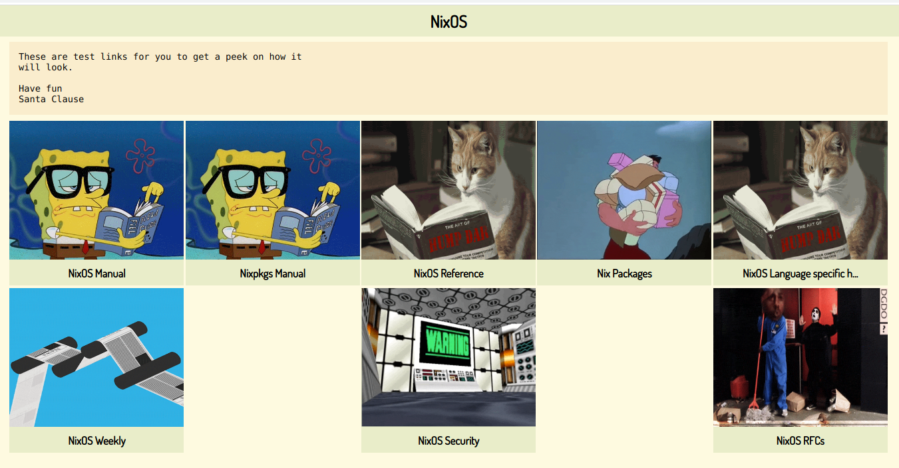

A simple HTML file using JSON to create a list of links.
This is useful to collect links for projects or the teams you are working in.



Have a look at [this github page](https://mrvandalo.github.io/landingpage/) for a working example.

## structure

You define everything via JSON (or nix if you use the nix module).

```json
{
  "title": "title",
  "text": "text",
  "items" : [
    {
      "label": "go to example.com",
      "href": "https://example.com",
      "image": "https://media.giphy.com/media/xrrvZiFNuK7Xa/giphy.gif"
    },
    {
      "label": "go to other example.com",
      "href": "https://other-example.com",
      "image": "https://media.giphy.com/media/xrrvZiFNuK7Xa/giphy.gif"
    }
  ]
}
```

## Using JavaScript

Just download the [index.html](./docs/index.html) from the `docs` folder.
Edit the script variable `contentItmes` and you voilà, you have you own landing page.

## Using NixPkgs

The nix-flake provides a package that can be used to generate a fully static html page.

``` nix
services.nginx.virtualHosts."example.org" = {
  locations."/" = {
    root = pkgs.landingpage.override { 
      jsonConfig = [{
        title = "title";
        text = "text";
        items = [
          {
            label = "go to example.com";
            href = "https://example.com";
            image = "https://media.giphy.com/media/xrrvZiFNuK7Xa/giphy.gif";
          }
          {
            label = "go to example.com";
            href = "https://example.com";
            image = "https://media.giphy.com/media/xrrvZiFNuK7Xa/giphy.gif";
          }
        ];
      }];
    };
  };
};
```

### parameter to override

- `title`: browser tab title
- `max-width`:  width of the content block
- `background-color`: background color of the whole page
- `title-color`: color of the title block
- `title-background-color`: background color of the title block
- `text-color`: text color of the text block
- `text-background-color`: background color of the text block
- `item-color`: text color of the items
- `item-background-color`: background color of the items
- `image-width`: width of the images
- `image-height`: height of the images
- `jsonConfig`: the content defined under structure